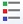

Stijl Laden
====

De tool kan worden geactiveerd met het icoon op de toolbalk: 

Deze tool laat toe om een .qml stijl bestand toe te passen op een ingeladen laag in QGIS.
De gebruiker kan een folder instellen waar hij een reeks van QML-bestanden heeft staan. 

Hij kan daarna een stijl selecteren uit de lijst en de een laag om die stijl op toe te passen uit de dropdown.

Of een bepaalde stijl toepasbaar op een bepaald type laag moet de gebruiker zelf bepalen.

